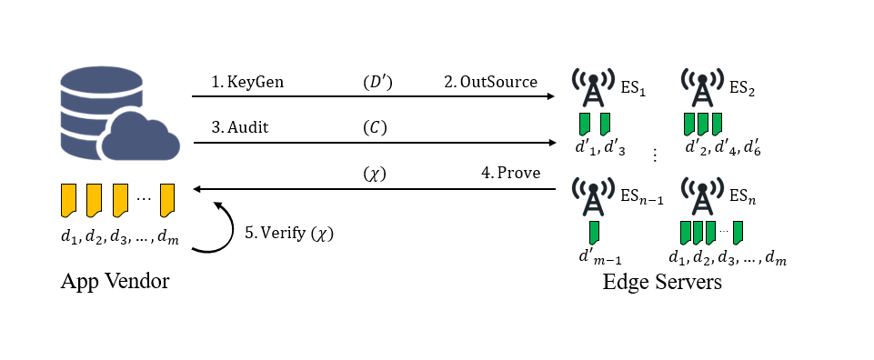

# EDI-MD: Efficient and Secure Data Integrity Auditing for Multi-Data Edge Computing

This is the companion source code repository for our EDI-MD scheme. Edge computing has emerged as a pivotal paradigm to reduce latency by deploying computational resources closer to end-users. However, ensuring data integrity in edge computing environments—known as the Edge Data Integrity (EDI) problem—remains a critical challenge, especially in multi-data scenarios where edge servers store heterogeneous data replicas to meet region-specific demands.

Unlike traditional single-data scenarios, multi-data environments introduce significant computation and communication overhead. In this work, we propose EDI-MD, a novel scheme designed to correctly, securely, and efficiently process EDI auditing. The proposed solution leverages the intrinsic properties of distributed data storage and employs a lightweight HMAC-based verification mechanism with zero-sum coefficients. This approach significantly reduces computation and communication overhead while ensuring robust detection of data corruption and resistance against malicious behaviors such as forgery and replay attacks.

This repository provides the open-source implementation of the EDI-MD prototype, demonstrating its practicality and superior efficiency compared to state-of-the-art solutions.



## Build

First, clone the repository:

```bash
git clone https://github.com/szu-security-group/EDI-MD.git
```
We use java (JDK 17) to develop this project and use IntelliJ IDEA and Maven to compile and manage it.

## Usage

We provide a python script ```run_java.py``` to run the experiment, you can modify the parameters in ```run_java.py``` to fit your environment.
you can run
```bash
python  run_java.py
```
to start the experiment or just run the ```Benchmark```.
